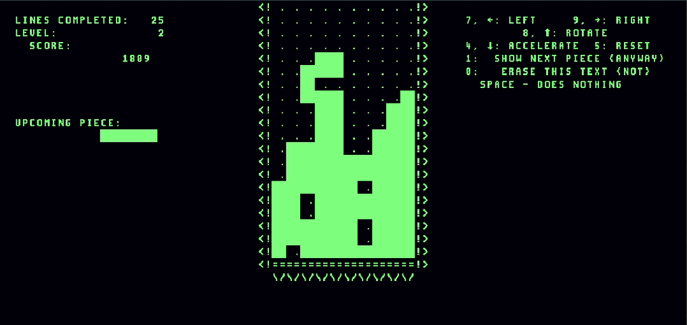

# Chetyris

Chetyris is an assembly implementation of a falling‑block puzzle game for the Symphony architecture inside the videogame Turing Complete. It is an educational recreation inspired by the [Elektronika 60 version of the original 1984 Tetris](https://youtu.be/O0gAgQQHFcQ) created by Alexey Pajitnov.



## Features
* Has levels of increasing difficulty
* Scoring incorporates push-down points and bonuses for multiple lines completed
* Displays the score, lines completed and current level in decimal
* Detects the game over state and stops the game
* This project uses all IO devices of the Symphony architecture: keyboard, time and screen. The Turing Complete game campaign levels only require wiring the components but there is no level requiring you to use or code with them.

## How to use
The code is intended to be used with the canon symphony architecture and spec.isa file. The steps are:

1. Load the file as chetyris.asm in the main memory of your symphony architecture in the sandbox mode.
2. Set the keyboard component to "Location mode".
3. Activate the recording of the keyboard.
4. Run the simulation with a frequency of 10-100kHz. The piece fall speed is independent of the clock but the drop speed not. Higher frequency results in harder drops.

Controls are:
* 7 or arrow key left to move the piece left
* 9 or arrow key right to move the piece right
* 8 or arrow key up to rotate the piece counterclockwise
* 4 or arrow key down to drop the piece faster

## Scoring

* 1 point per line manually pushed down.
* 10 points for a single line completed
* 30 points for a double. 
* 60 points for a triple.
* 100 points for a quadruple.
* the line completion bonuses are multiplied with (level + 1). A double scores 90 points on level 2 for example.

The level starts at 0. It is increased to 1 at a score of 100 points and is incremented with each following decade reached.

## Implementation

This chapter will not exhaustively describe the implementation but rather highlight certain aspects which might not be immediately clear when reviewing the code.

### Random Number Generation
For the pseudo-random piece generation the current time in nanoseonds is read. The least significant 9 bits are xor-ed together in groups of three to get a number from 0-7. Since there are only 7 pieces the number generation is run again if the result is 7. The numbers 0-6 are mapped to individual pieces.

### Transformations
The pieces are not handled in 4x4 matrices like other implementations do, but by storing the four addresses of the individual piece blocks. Movement in any direction is done by adding an offset to all addresses. Rotation is done by defining the first address as the center of rotation. Each other address is mapped to a new address determined by the relative location to the first address. This rotation system results in non-standard rotations, particularly adding the ability of rotating the square.

The pieces are first cleared to allow checking for collisions while avoiding self-collision. Only after that the piece is redrawn at the new location. A game over is detected if a spawning piece causes a collision.

### Multiplication
Multiplication and division are not part of the canon symphony architecture although it makes sense to add them to the spec as such:

```
mul %a(register), %b(register), %c(register)
00101100 aaaabbbb 0000cccc 00000000
# Multiply %b by %c and store the result in %a.

div %a(register), %b(register), %c(register)
00101101 aaaabbbb 0000cccc 00000000
# Divide %b by %c and store the result in %a.

mul %a(register), %b(register), %c:U16(immediate | label)
00111100 aaaabbbb cccccccc cccccccc
# Multiply %b by %c and store the result in %a.

div %a(register), %b(register), %c:U16(immediate | label)
00111101 aaaabbbb cccccccc cccccccc
# Divide %b by %c and store the result in %a.
```

Instead, the multiplication routine uses a classic shift‑and‑add algorithm, sometimes known as Russian Peasant Multiplication. Instead of relying on a hardware multiplier, it repeatedly checks the lowest bit of the smaller factor: if the bit is set, the larger factor is added to the result. After each iteration, the larger factor is shifted left (×2) and the smaller factor is shifted right (÷2). This continues until the smaller factor becomes zero. The method is efficient, requires only bit shifts and additions, and fits perfectly into minimal ISAs that restrict arithmetic operations.

### Division
Division is only needed to convert the score from binary to decimal. So only the division by the constant 10 is needed. Division can be expressed as multiplication with the reciprocal, in this case multiplying with 1/10. If it was possible to approximate 1/10 by a fraction a/b in a way that allows to express the denominator as a power of two then the division part could be done by shifting right:

```
x/10 = x*1/10 ~ x*a/b = (x*a) >> log_2(b)

```

In this case 2^17 = 131072 is chosen as the power of 2 or b. Then 131072/10 = 13107.2 so a=13108 is chosen. The approximation needs to overestimate since the shifting will only discard bits (meaning round down). So division is done by multiplying by 13108 and then shifting the result 17 bits to the right. The error from the truth of 1/10 is e=0.000006 and will only matter at very high scores, namely after 1/10/e ~ 16000.

## Etymology
Chetyris is a combination of the Russian word for four ("четыре", chetyre) and "Tennis"

## License
Chetyris is licensed under the Boost Software License 1.0

## Disclaimer
Chetyris is an independent, original Tetris‑like game.
It is not affiliated with or endorsed by The Tetris Company, LLC.
"Tetris" is a registered trademark of The Tetris Company, LLC.
